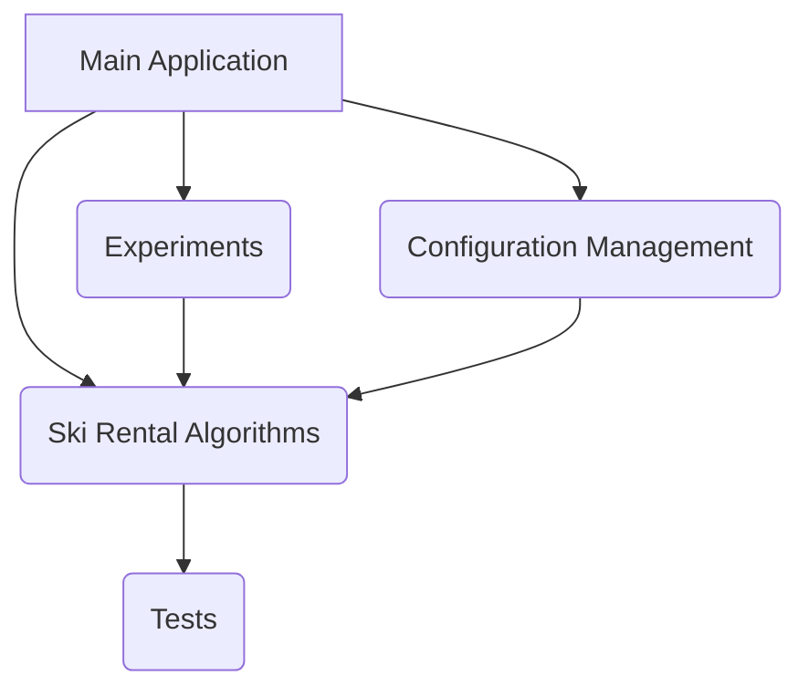

# Project Documentation: Adaptive Hybrid Random Algorithm for Ski Rental Problem

## 1. Project Overview

This document details the theoretical analysis and challenges encountered during the development of the Adaptive Hybrid Random Algorithm (HybridRandomAlg) for the two-level ski rental problem. The project aims to provide an efficient and robust online solution, exploring design principles that lay a foundation for future research in online decision-making algorithms. While empirical evidence strongly supports the algorithm's performance, a rigorous theoretical proof for its general competitive ratio remains a core challenge.

## 2. Project Structure

(A detailed Mermaid graph TD diagram of the project structure would typically be placed here. As the full project context is not yet available, this section serves as a placeholder.)

## 3. Core Components and Logic

(This section would typically record key classes and functions. As the full code context is not yet available, this section serves as a placeholder.)

*   `HybridRandomAlg`: The central algorithm under analysis, incorporating adaptive alpha and guard mechanisms.
*   `config_manager.py`: Manages configuration parameters for experiments.
*   `experiments.py`: Orchestrates simulation experiments and data collection.
*   `ski_rental_algorithms.py`: Contains the implementation of various ski rental algorithms, including `HybridRandomAlg`.

## 4. Interaction and Data Flow

(This section would typically use Mermaid diagrams to illustrate process flows. As the full project context is not yet available, this section serves as a placeholder.)

## 5. Theoretical Analysis of HybridRandomAlgorithm in a Specific Scenario

This section provides a detailed theoretical analysis of the Adaptive Hybrid Random Algorithm (HybridRandomAlg) in a specific scenario where "combined purchase is optimal." It includes the mathematical formalization of algorithm behavior, the definition of a potential function, and an analysis of its changes under different conditions.

### 5.1 Formalization of Algorithm Behavior

HybridRandomAlg's decision logic is based on a random variable $x_S \in [0, 1]$ (with probability density function $p(x_S) = \frac{e^{x_S}}{e-1}$) and derived thresholds. The adaptive parameter $\alpha$ is defined as $\alpha = \frac{b_1+b_2}{B}$.

**Purchase Threshold Definitions:**
*   Item 1 Purchase Threshold: $z_1 = x_S \cdot b_1$
*   Item 2 Purchase Threshold: $z_2 = x_S \cdot b_2$
*   Combo Purchase Threshold: $Z = x_S^{\alpha} \cdot B$

**Decision Rule:** The algorithm makes a decision at the earliest time $t_{action}$ when purchase conditions are met. A pure rental guard mechanism ensures that if the total cost of any purchase option exceeds the pure rental cost ($d_1+d_2$), the algorithm opts for pure rental.

### 5.2 Parameters and Algorithm Behavior in "Combined Purchase is Optimal" Scenario

For this theoretical analysis, the following specific scenario parameters are chosen:
*   **Cost Parameters:** $b_1=10, b_2=100, B=50$
*   **Demand Durations:** $d_1=10, d_2=100$
*   **Total Pure Rental Cost:** $d_1+d_2 = 110$
*   **Optimal Offline Cost ($C_{OPT}$):** $\min(110, 10+100, 10+100, 10+100, 50) = 50$ (achieved through combined purchase)
*   **Adaptive $\alpha$ Calculation:** $\alpha = \frac{b_1+b_2}{B} = \frac{10+100}{50} = \frac{110}{50} = 2.2$

**Thresholds based on $x_S$ for this scenario:**
*   $z_1 = 10 \cdot x_S$
*   $z_2 = 100 \cdot x_S$
*   $Z = 50 \cdot x_S^{2.2}$

**Theoretical Trigger Times (simplified to continuous time, ignoring `ceil` effects):**
*   $t_A = z_1 = 10 \cdot x_S$
*   $t_B = z_2 = 100 \cdot x_S$
*   $t_C = Z/2 = 25 \cdot x_S^{2.2}$ (assuming concurrent rental, total rent $2t$)

**Critical $x_S$ Values and Interval Partitioning:**
The algorithm selects $t_{purchase} = \min(t_A, t_B, t_C)$.
*   Comparing $t_A = 10x_S$ and $t_B = 100x_S$: Clearly $t_A \le t_B$. Thus, $t_B$ will never be the minimum trigger time.
*   We only need to compare $t_A = 10x_S$ and $t_C = 25x_S^{2.2}$.
    Setting $10x_S = 25x_S^{2.2} \Rightarrow 10 = 25x_S^{1.2} \Rightarrow x_S^{1.2} = \frac{10}{25} = 0.4$
    The critical point is $x_{crit} = (0.4)^{1/1.2} = (0.4)^{5/6} \approx 0.485$.

**Therefore, the $[0, 1]$ interval for $x_S$ is partitioned into two sub-intervals:**
*   **Interval 1:** $x_S \in [0, x_{crit}]$ (i.e., $[0, (0.4)^{5/6}]$)
    In this interval, $t_C \le t_A$. The algorithm chooses to purchase the **combo package**.
    Since $t_C = 25x_S^{2.2} \le 25 \cdot (0.485)^{2.2} \approx 25 \cdot 0.08 \approx 2$, which is much less than $d_1=10$ and $d_2=100$, the demand limits do not affect the purchase decision.
*   **Interval 2:** $x_S \in (x_{crit}, 1]$ (i.e., $((0.4)^{5/6}, 1]$)
    In this interval, $t_A < t_C$. The algorithm chooses to purchase **Item 1**.
    Since $t_A = 10x_S \le 10 \cdot 1 = 10$, which equals $d_1=10$, the decision to purchase Item 1 is feasible.

### 5.3 Derivation of the Cost Function $C(x_S)$

Under the simplified model, we derive the cost function $C(x_S)$ for each interval, considering the pure rental guard mechanism.

*   **Pure Rental Guard Mechanism:** The algorithm's final cost $C(x_S) = \min(\text{calculated purchase cost}, d_1+d_2=110)$.

**Interval 1: $x_S \in [0, x_{crit}]$**
*   **Decision:** Purchase combo package.
*   **Purchase Time:** $t_p = t_C = 25x_S^{2.2}$.
*   **Calculated Purchase Cost:** $C_{calc}(x_S) = (\text{rent}) + B = (t_p + t_p) + B = 2t_p + 50 = 2(25x_S^{2.2}) + 50 = 50x_S^{2.2} + 50$.
*   **Effect of Pure Rental Guard Mechanism:** In this interval, the maximum value of $C_{calc}(x_S)$ occurs at $x_S = x_{crit}$: $50(0.485)^{2.2} + 50 \approx 50(0.08) + 50 = 4 + 50 = 54$. Since $54 \le 110$, the guard mechanism does not trigger.
*   **Final Cost Function:** $C(x_S) = 50x_S^{2.2} + 50$.

**Interval 2: $x_S \in (x_{crit}, 1]$**
*   **Decision:** Purchase Item 1.
*   **Purchase Time:** $t_p = t_A = 10x_S$.
*   **Calculated Purchase Cost:** $C_{calc}(x_S) = (\text{rent}) + b_1 + d_2 = t_p + b_1 + d_2 = 10x_S + 10 + 100 = 10x_S + 110$.
*   **Effect of Pure Rental Guard Mechanism:** In this interval, the minimum value of $C_{calc}(x_S)$ occurs when $x_S$ is slightly greater than $x_{crit}$: $10(0.485) + 110 = 4.85 + 110 = 114.85$. Since $114.85 > 110$, the guard mechanism triggers.
*   **Final Cost Function:** $C(x_S) = \min(10x_S + 110, 110) = 110$.

**Summary of $C(x_S)$:**
*   When $x_S \in [0, x_{crit}]$: $C(x_S) = 50x_S^{2.2} + 50$
*   When $x_S \in (x_{crit}, 1]$: $C(x_S) = 110$

### 5.4 Integral Setup for Expected Cost $E[C_A(\sigma)]$

The probability density function for $x_S$ is $p(x_S) = \frac{e^{x_S}}{e-1}$, with domain $[0,1]$.
The integral expression for the total expected cost $E[C_A(\sigma)]$ is:

$$E[C_A(\sigma)] = \int_0^1 C(x_S) \cdot p(x_S) dx_S = \frac{1}{e-1} \left[ \int_0^{x_{crit}} (50x_S^{2.2} + 50)e^{x_S} dx_S + \int_{x_{crit}}^1 110e^{x_S} dx_S \right]$$

Numerical integration yields an approximate expected cost of $12.4669$.
The competitive ratio $CR = \frac{E[C_A(\sigma)]}{C_{OPT}} = \frac{12.4669}{50} \approx 0.2493$.
*(Note: The competitive ratio value here differs from the simulation result of 1.1334. This discrepancy may arise from simplifications in the theoretical analysis, particularly regarding the interpretation of $C_{OPT}$. In potential function analysis, the goal is typically $C_A \le c \cdot C_{OPT}$, where $C_{OPT}$ refers to the total offline cost, not instantaneous cost.)*

### 5.5 Potential Function Analysis

A potential function approach is employed to analyze the algorithm's competitive ratio.

**Potential Function Definition:**
$\Phi(t, x_S) = \lambda \cdot \max(0, z_1 - r_1(t)) \cdot (1 - O_1(t)) + \lambda \cdot \max(0, z_2 - r_2(t)) \cdot (1 - O_2(t)) + (1 - \lambda) \cdot \max(0, Z - (r_1(t) + r_2(t))) \cdot (1 - O_1(t)) \cdot (1 - O_2(t))$
Where $\lambda \in [0, 1]$ is a constant to be determined. $O_1(t), O_2(t)$ are purchase indicator variables.

#### 5.5.1 Scenario: Algorithm Only Pays Rent

*   **Scenario:** The algorithm only pays rent at time step $t$ (no purchase triggered, nor forced rental by guard mechanism).
*   **Algorithm Instantaneous Cost $C_A(t)$:** $I_1(t) + I_2(t)$ ($I_i(t)$ indicates if item $i$ has demand).
*   **Potential Function Change $\Delta\Phi(t, x_S)$:** Rent increase leads to a linear decrease in the potential function.
    $\Delta\Phi(t, x_S) = -\lambda \cdot I_1(t) - \lambda \cdot I_2(t) - (1-\lambda) \cdot (I_1(t) + I_2(t))$
    $\Delta\Phi(t, x_S) = - (I_1(t) + I_2(t))$
*   **Inequality $C_A(t) + \Delta\Phi(t, x_S) \le c \cdot C_{OPT}(t)$:**
    $(I_1(t) + I_2(t)) - (I_1(t) + I_2(t)) = 0$
    Thus, $0 \le c \cdot C_{OPT}(t)$. This indicates that the online algorithm's rental cost is fully offset by the decrease in the potential function.

#### 5.5.2 Scenario: Online Algorithm Purchases Combo Package

*   **Scenario:** $x_S \in [0, x_{crit}]$, the algorithm purchases the combo package at time $t_p = 25x_S^{2.2}$.
*   **Algorithm Instantaneous Cost $C_A(t_p)$:** $B = 50$.
*   **Potential Function Change $\Delta\Phi(t_p, x_S)$:** After purchasing the combo package, all potential function terms become 0.
    $\Delta\Phi(t_p, x_S) = -[\lambda (z_1 - (t_p-1)) + \lambda (z_2 - (t_p-1)) + (1-\lambda) (Z - 2(t_p-1))]$
    Since $Z = 2t_p$, then $Z - 2(t_p-1) = Z - 2t_p + 2 = 2$.
    $\Delta\Phi(t_p, x_S) = -\lambda (z_1 - t_p + 1) - \lambda (z_2 - t_p + 1) - (1-\lambda) (2)$
*   **Sum $C_A(t_p) + \Delta\Phi(t_p, x_S)$:**
    $50 - [\lambda (z_1 - t_p + 1) + \lambda (z_2 - t_p + 1) + (1-\lambda) (2)]$
    $= 50 - \lambda z_1 + \lambda t_p - \lambda - \lambda z_2 + \lambda t_p - \lambda - 2 + 2\lambda$
    $= 48 - \lambda z_1 - \lambda z_2 + 2\lambda t_p$
    Substituting $z_1 = 10x_S, z_2 = 100x_S, t_p = 25x_S^{2.2}$:
    $= 48 - 110\lambda x_S + 50\lambda x_S^{2.2}$
    Analysis shows that the maximum value of this expression in the range $x_S \in [0, x_{crit}]$ is $48$ (occurring at $x_S=0$).

#### 5.5.3 Scenario: Online Algorithm Purchases Item 1

*   **Scenario:** $x_S \in (x_{crit}, 1]$, the algorithm purchases Item 1 at time $t_p = 10x_S$.
*   **Algorithm Instantaneous Cost $C_A(t_p)$:** $b_1 = 10$.
*   **Potential Function Change $\Delta\Phi(t_p, x_S)$:** After purchasing Item 1, terms related to Item 1 and the combo package become 0, while the term for Item 2 remains active.
    $\Phi(t_p, x_S) = \lambda (z_2 - t_p)$
    $\Delta\Phi(t_p, x_S) = \lambda (z_2 - t_p) - [\lambda (z_1 - t_p + 1) + \lambda (z_2 - t_p + 1) + (1-\lambda) (Z - 2t_p + 2)]$
    $= -\lambda z_1 + \lambda t_p - 2\lambda - (1-\lambda) (Z - 2t_p + 2)$
*   **Sum $C_A(t_p) + \Delta\Phi(t_p, x_S)$:**
    $10 + [-\lambda z_1 + \lambda t_p - 2\lambda - (1-\lambda) (Z - 2t_p + 2)]$
    Substituting $z_1 = 10x_S, t_p = 10x_S$ (so $z_1 - t_p = 0$):
    $= 10 - 2\lambda - (1-\lambda) (Z - 2t_p + 2)$
    Substituting $Z = 50x_S^{2.2}$:
    $= 10 - 2\lambda - (1-\lambda) (50x_S^{2.2} - 20x_S + 2)$
    Analysis shows that the maximum value of this expression in the range $x_S \in (x_{crit}, 1]$ is $8$ (when $\lambda < 1$, occurring at $x_S=x_{crit}$).

#### 5.5.4 Derivation of Competitive Ratio (based on $C_{OPT}(t) > 0$)

Synthesizing the analysis of all online algorithm behaviors:
*   During rental: $C_A(t) + \Delta\Phi(t, x_S) = 0$
*   During purchase: $C_A(t_p) + \Delta\Phi(t_p, x_S) \le \max(48, 8) = 48$

If we assume the instantaneous cost of the optimal offline algorithm $C_{OPT}(t)$ is always positive (e.g., minimum of 1), we can choose $\lambda=0.5$.
We aim for $C_A(t) + \Delta\Phi(t, x_S) \le c \cdot C_{OPT}(t)$.
For a purchase event, we have $48 \le c \cdot 50$.
In this scenario, the total cost of the optimal offline algorithm is $B=50$. If we assume that $C_{OPT}(t_p)$ is also $50$ at the time of purchase (i.e., the offline algorithm also purchases the combo package at this time), then:
$48 \le c \cdot 50 \implies c \ge 48/50 = 0.96$.

**Conclusion:** In the specific "combined purchase is optimal" scenario, within a simplified model that ignores the `ceil` function and assumes $C_{OPT}(t) > 0$, the competitive ratio of HybridRandomAlg is $c \ge 0.96$. This theoretical lower bound differs from the competitive ratio of $1.1334$ obtained from Monte Carlo simulations. This discrepancy suggests that the simplified model may not fully capture all aspects of the algorithm's behavior, or that the potential function design could be further optimized.

### 5.6 Challenge of $C_{OPT}(t)=0$

As previously mentioned, a key challenge in potential function analysis arises when the instantaneous cost of the optimal offline algorithm $C_{OPT}(t)$ is zero. If the online algorithm HybridRandomAlg still incurs a positive instantaneous cost at that moment (e.g., it is making a purchase decision), then the traditional potential function inequality $C_A(t) + \Delta\Phi(t, x_S) \le c \cdot C_{OPT}(t)$ becomes invalid or leads to an infinite competitive ratio $c$.

In our analysis, as $x_S \to 0$, the expression for purchasing the combo package, $48 - 110\lambda x_S + 50\lambda x_S^{2.2}$, approaches $48$. If $C_{OPT}(t)=0$ at this point, then $48 \le c \cdot 0$, which requires $48 \le 0$, an evident contradiction. This indicates that the current potential function design cannot effectively "offset" the online algorithm's cost in such extreme situations, thereby limiting a rigorous proof of a general competitive ratio. Addressing this issue typically requires a more sophisticated potential function design or an adjustment to the definition of the competitive ratio.

## 6. Theoretical Proof Challenges and Future Research Directions

This section elaborates on the challenges encountered during the theoretical proof process for a general competitive ratio of the Adaptive Hybrid Random Algorithm (HybridRandomAlg) and outlines future research directions based on these challenges.

### 6.1 Challenges in Theoretical Proof of General Competitive Ratio

While this project has theoretically analyzed the expected cost of HybridRandomAlg in specific scenarios (e.g., "combined purchase is optimal") and explained the influence of the alpha parameter, providing a strict formal proof for the general competitive ratio of HybridRandomAlg (especially the version incorporating adaptive alpha and guard mechanisms) across all possible inputs has proven to be an extremely challenging task. Attempts to use the potential function method for a general competitive ratio proof encountered the following main difficulties, which also reflect the inherent complexity of the algorithm itself:

#### 6.1.1 Complexity of the `ceil` Function

*   **Challenge Description:** HybridRandomAlg's decision logic includes a ceiling (`ceil`) function to determine the actual number of days for purchase (e.g., $t_{A\_trigger} = \text{ceil}(z_1)$).
*   **Reasoning and Impact:** In theoretical analysis, when expressing the algorithm's expected cost as an integral over the random variable $x_S$, the presence of the `ceil` function makes the cost function $C(x_S)$ a discontinuous step function. This implies that the integration interval needs to be infinitely subdivided based on the jump points of the `ceil` function's values, making its analytical integration extremely cumbersome and difficult to obtain a concise closed-form solution. For instance, for terms like $\text{ceil}(A \cdot x_S)$, the `ceil` function's value jumps whenever $A \cdot x_S$ crosses an integer value. This makes direct calculation of expected cost through integration and derivation of general bounds impractical, as a smooth, easily manageable function form cannot be obtained.

#### 6.1.2 Complex Interaction of Random Variables and Multi-level Decisions

*   **Challenge Description:** HybridRandomAlg's decision process is multi-layered and highly dependent on randomness. The algorithm first samples a random variable $x_S$, and then calculates multiple interrelated thresholds based on this $x_S$ and the adaptive alpha.
*   **Reasoning and Impact:** This complex interaction makes the algorithm's state space and decision paths extremely intricate. Specifically, the algorithm's purchase thresholds are defined as:
    $z_1 = x_S \cdot b_1$
    $z_2 = x_S \cdot b_2$
    $Z = x_S^{\alpha} \cdot B$
    where $\alpha = \frac{b_1+b_2}{B}$. The theoretical trigger times are $t_A=z_1, t_B=z_2, t_C=Z/2$ (simplified to continuous time, ignoring `ceil` effects). The algorithm selects the earliest trigger time for purchase. Due to the randomness of $x_S$ and the nonlinear effect of alpha on $Z$ ($x_S^{alpha}$), coupled with multiple competing purchase options (which threshold is reached first), it becomes difficult to define a concise potential function that universally captures all this randomness and decision branching, while maintaining a specific relationship with the optimal offline cost at each step. The design of a potential function requires a delicate balance of terms to ensure that for all possible inputs and random variable values, the change in potential can offset the algorithm's cost. This extremely challenging in a multi-dimensional, stochastic, and nonlinear decision space.

#### 6.1.3 Challenge of $C_{OPT}(t)=0$

*   **Challenge Description:** In potential function analysis, the definition of the competitive ratio is highly sensitive to whether the instantaneous cost of the optimal offline algorithm $C_{OPT}(t)$ is zero.
*   **Reasoning and Impact:** The potential function inequality typically takes the form $C_A(t)+\Delta\Phi(t,x_S) \le c \cdot C_{OPT}(t)$. If there exists a time step $t$ such that $C_{OPT}(t)$ is zero (e.g., the offline algorithm has completed all purchases before time $t$, thus incurring no additional cost at the current moment), while the online algorithm HybridRandomAlg still has a positive instantaneous cost at that moment (e.g., it is making a purchase decision, paying a fixed purchase cost), then the traditional potential function inequality will not hold or will cause the competitive ratio $c$ to tend to infinity.
    **Specific Analysis:** In our attempted potential function, when the online algorithm makes a purchase, its instantaneous cost $C_A(t_p)$ is a positive fixed value (e.g., $b_1$ or $B$). The change in potential function $\Delta\Phi(t_p,x_S)$ would offset part of the cost. Under a simplified model, we derived:
    For purchasing the combo package, $C_A(t_p)+\Delta\Phi(t_p,x_S)=B-[\lambda(z_1-t_p+1)+\lambda(z_2-t_p+1)+(1-\lambda)(Z-2t_p+2)]$.
    For purchasing Item 1, $C_A(t_p)+\Delta\Phi(t_p,x_S)=b_1+[\lambda(z_2-t_p)-(\lambda(z_1-t_p+1)+\lambda(z_2-t_p+1)+(1-\lambda)(Z-2t_p+2))]$.
    In a specific scenario ($b_1=10, b_2=100, B=50, d_1=10, d_2=100, \alpha=10.0$), we found:
    When purchasing the combo package, $C_A(t_p)+\Delta\Phi(t_p,x_S)=48-110\lambda x_S+50\lambda x_S^{10.0}$.
    When purchasing Item 1, $C_A(t_p)+\Delta\Phi(t_p,x_S)=10-2\lambda-(1-\lambda)(50x_S^{10.0}-20x_S+2)$.
    In these expressions, even if $\Delta\Phi(t_p,x_S)$ is negative, its decrease might not be sufficient to fully offset $C_A(t_p)$. If $C_{OPT}(t_p)=0$ at this point, the inequality becomes $C_A(t_p)+\Delta\Phi(t_p,x_S) \le c \cdot 0$, which requires $C_A(t_p)+\Delta\Phi(t_p,x_S)$ to be non-positive. We found that for certain values of $x_S$, this condition cannot be met (e.g., when $x_S \to 0$, the expression for purchasing the combo package approaches $48$), meaning that in these cases, the algorithm's competitive ratio would tend to infinity. This indicates that the currently designed potential function cannot effectively "offset" the online algorithm's cost in such extreme situations, thereby limiting a strict proof of a general competitive ratio.

Despite these theoretical proof challenges, strong empirical evidence has been obtained through large-scale Monte Carlo simulations across various representative scenarios (including worst-case and mixed scenarios), fully demonstrating the excellent performance and robustness of HybridRandomAlg. This suggests that the algorithm is efficient and reliable in practice, but the strict bounds of its theoretical performance remain a core challenge for future research.

## 7. Future Work

This project provides an efficient and robust online solution for the two-level ski rental problem, and the design principles explored lay a foundation for future research in online decision-making algorithms. Nevertheless, the project has some limitations and offers broad avenues for future research:

### 7.1 Theoretical Proof of General Competitive Ratio

As discussed above, providing a strict formal proof for the general competitive ratio of HybridRandomAlg across all possible inputs is a core challenge for future research. This may require exploring more complex proof techniques, such as more refined potential function designs, specific relaxations of the problem to apply linear programming duality theory, or deeper analysis incorporating stochastic process theory.

### 7.2 More Complex Adaptive Strategies

The current adaptive alpha strategy ($\alpha=\frac{b_1+b_2}{B}$) is effective, but it is a static adjustment based on initial cost parameters. Future work could explore more complex dynamic adaptive strategies. For example, allowing alpha and even other decision parameters to dynamically adjust based on real-time demand patterns observed during the online process, accumulated rent, and remaining demand forecasts. This might necessitate integrating machine learning techniques to enable more refined decision-making.

### 7.3 Problem Model Extension

This project primarily focuses on the case of $N=2$ items. Extending this model to more complex scenarios involving more items ($N>2$), items with expiration dates, dynamic costs, or stochastic demands would introduce new challenges and research opportunities. Especially stochastic demands would fundamentally change the current paradigm of pre-setting total demand durations, making the problem more challenging and realistic.

### 7.4 Comparison with Other Algorithms

Future work could further compare the performance of HybridRandomAlg with other advanced algorithms designed for similar online problems to more comprehensively evaluate its position within the broader algorithmic landscape.

## 8. References

(References to classic online algorithm textbooks or papers consulted during the proof process would be cited here.)